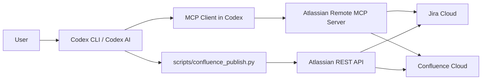

# Codex / MCP / Script Relationship (Test Doc)

이 문서는 `Codex AI`, `Atlassian MCP`, `로컬 스크립트`의 관계를 테스트용으로 도식화한 문서입니다.

## 1) 전체 구조 (개념도)



## 2) 텍스트 다이어그램 (Mermaid 미지원 환경용)

```text
[User]
   |
   v
[Codex AI]
   | \
   |  \--(Run local automation)--> [confluence_publish.py] --REST API--> [Confluence/Jira]
   |
   \--(Tool call via MCP)--> [Atlassian Remote MCP Server] --> [Confluence/Jira]
```

## 3) 역할 분리

- `Codex AI`
  - 전체 작업 흐름을 조율
  - MCP 도구 호출 또는 로컬 스크립트 실행 지시

- `Atlassian MCP (Remote)`
  - Codex가 Jira/Confluence 기능을 호출하는 표준 인터페이스
  - OAuth 기반 연결 (`codex mcp add/login`)

- `scripts/confluence_publish.py`
  - Markdown 파일을 Confluence로 게시하는 배치 자동화
  - API Token으로 REST API 직접 호출

## 4) 실제 동작 패턴

1. **MCP 경로**
   - User -> Codex -> MCP -> Atlassian
   - 탐색/조회/대화형 작업에 적합

2. **스크립트 경로**
   - User -> Codex(또는 직접 실행) -> Python Script -> REST API
   - 반복/대량 게시 자동화에 적합

## 5) 핵심 포인트

- MCP와 스크립트는 경쟁 관계가 아니라 보완 관계
- `MCP`: 연결성과 도구 호출
- `Script`: 정형화된 대량 처리와 재현성

