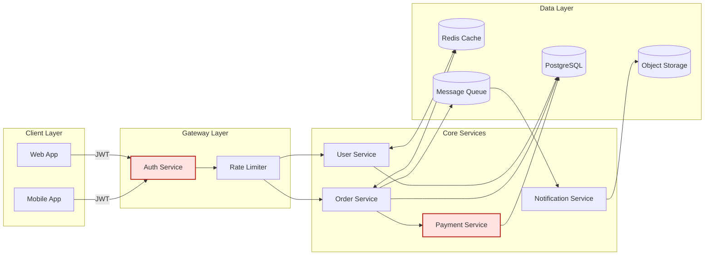
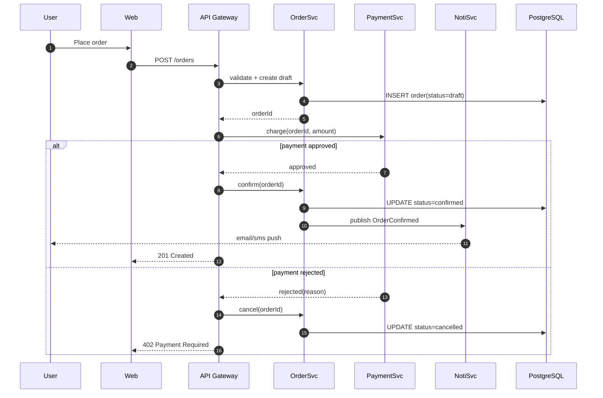

# Mermaid Complex Rendering Test

아래는 복잡한 Mermaid 다이어그램 2종 테스트입니다.

## 1) 시스템 아키텍처 플로우

```mermaid
flowchart LR
  subgraph Client[Client Layer]
    Web[Web App]
    Mobile[Mobile App]
  end

  subgraph Gateway[Gateway Layer]
    Auth[Auth Service]
    Rate[Rate Limiter]
  end

  subgraph Core[Core Services]
    User[User Service]
    Order[Order Service]
    Payment[Payment Service]
    Noti[Notification Service]
  end

  subgraph Data[Data Layer]
    PG[(PostgreSQL)]
    Redis[(Redis Cache)]
    MQ[(Message Queue)]
    S3[(Object Storage)]
  end

  Web -->|JWT| Auth
  Mobile -->|JWT| Auth
  Auth --> Rate
  Rate --> User
  Rate --> Order
  Order --> Payment
  Order --> MQ
  MQ --> Noti

  User --> PG
  Order --> PG
  Payment --> PG

  User <--> Redis
  Order <--> Redis
  Noti --> S3

  classDef critical fill:#ffe2e2,stroke:#b42318,stroke-width:2px;
  class Auth,Payment critical;
```

## 2) 주문 처리 시퀀스

```mermaid
sequenceDiagram
  autonumber
  participant U as User
  participant W as Web
  participant A as API Gateway
  participant O as OrderSvc
  participant P as PaymentSvc
  participant N as NotiSvc
  participant DB as PostgreSQL

  U->>W: Place order
  W->>A: POST /orders
  A->>O: validate + create draft
  O->>DB: INSERT order(status=draft)
  O-->>A: orderId

  A->>P: charge(orderId, amount)
  alt payment approved
    P-->>A: approved
    A->>O: confirm(orderId)
    O->>DB: UPDATE status=confirmed
    O->>N: publish OrderConfirmed
    N-->>U: email/sms push
    A-->>W: 201 Created
  else payment rejected
    P-->>A: rejected(reason)
    A->>O: cancel(orderId)
    O->>DB: UPDATE status=cancelled
    A-->>W: 402 Payment Required
  end
```
