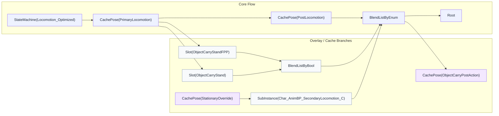
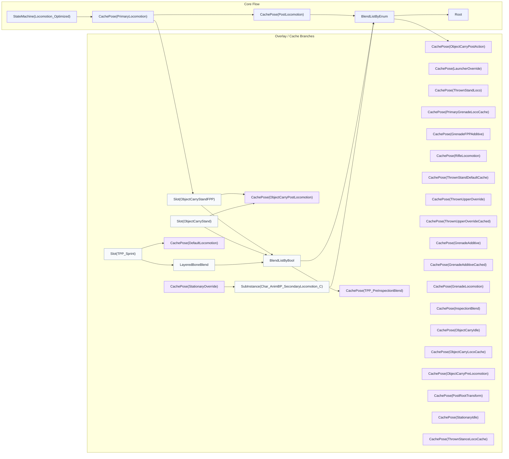
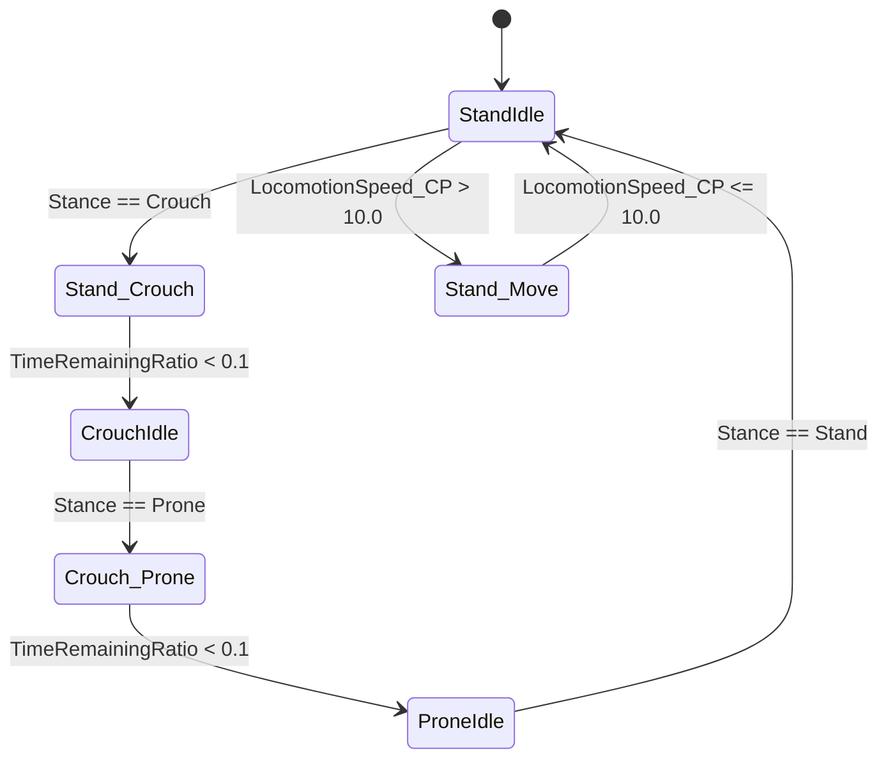

# Char_AnimBP_Locomotion 분석 보고서

## 1. 분석 문서 개요

| 항목 | 내용 |
| :--- | :--- |
| **대상 Asset** | `/Game/Animations/AnimBPs/SubAnimBPs/Char_AnimBP_Locomotion.Char_AnimBP_Locomotion` |
| **asset_id** | `_Game_Animations_AnimBPs_SubAnimBPs_Char_AnimBP_Locomotion` |
| **ParentClass** | `/Script/TslGame.TslSubAnimInstance_Locomotion` |
| **문서 개요** | AnimBP 구조를 위키 공유용으로 고정하고, 디버깅 우선순위를 신속하게 파악하기 위함 |
| **기준 데이터** | `animbp.get_overview`, `list_state_machines`, `list_slots`, `get_cachepose_graph`, `get_transition_signatures`, `get_analysis_detail`, `get_index_summary` |
| **기준 시점** | 2026-02-26 |

**전반 개요:**
`Char_AnimBP_Locomotion`은 `Locomotion_Optimized` 상태 머신을 핵심 엔진으로 삼아 이동 및 행동 포즈를 생성합니다. `SaveCachedPose(PrimaryLocomotion)`를 기점으로 포즈를 재사용하며, 슬롯 오버레이 합성을 거쳐 최종 `Root`로 출력되는 구조를 가집니다. 입력 단계의 전이 변수와 슬롯 가중치가 애니메이션의 품질을 결정하며, 출력 직전의 합성 순서가 프레임 지연 및 끊김 현상을 좌우하는 핵심 요소입니다.

---

## 2. 시스템 흐름 (StateMachine / CachePose / DataAsset)

`Char_AnimBP_Locomotion`은 **StateMachine 3개, Slot 4개, CachePose 25개, Transition 106개**로 구성된 복잡한 구조를 가지며, 최종 출력은 `BlendListByEnum`을 거쳐 `Root` 노드로 수렴합니다.

### 2.1 핵심 역할 요약
본 AnimBP의 주된 역할은 `Locomotion_Optimized` 루프에서 기본 전신 포즈를 생성하고, `CachePose`와 `Slot`을 활용해 상황별 상체 동작 및 행동 오버레이를 합성하여 안정적인 포즈를 출력하는 것입니다. 게임플레이 시 이동과 행동 전환의 자연스러움을 담당하며, 운영적 관점에서는 전이 변수의 타이밍 제어가 품질의 핵심입니다.

### 2.2 핵심 처리 체인 (식별자 포함)
- **기본 루프:** `StateMachine(Locomotion_Optimized)` → `SaveCachedPose(PrimaryLocomotion)` → `UseCachedPose(PostLocomotion)` → `BlendListByEnum` → `Root`
- **슬롯 분기(FPP):** `Slot(ObjectCarryStandFPP)` → `BlendListByBool` → `BlendListByEnum` → `SaveCachedPose(ObjectCarryPostAction)`
- **슬롯 분기(TPP):** `Slot(ObjectCarryStand)` → `BlendListByBool` → `BlendListByEnum` → `SaveCachedPose(ObjectCarryPostAction)`
- **질주 분기:** `Slot(TPP_Sprint)` → `LayeredBoneBlend` → `BlendListByBool` → `SaveCachedPose(TPP_PreInspectionBlend)`

### 2.3 시스템 흐름 구조도 (주요 분기)

### 2.4 CachePose 전체 커버리지 다이어그램 (25개 누락 없음)

---

## 3. 상태 그룹 (Asset-specific categories)

### 3.1 상태 그룹 요약

| Group | 상태/구성 단위 | 핵심 전이 변수 | 대표 경로 |
| :--- | :--- | :--- | :--- |
| **BodyCarry** | 상태 7 / 전이 14 | `CooperationAnimState`, `LocomotionSpeed_CP`, `bFinishedBodyCarryPickUp`, `bIsBodyCarryDrop` | Drop → PickUp → Idle → Drop |
| **Locomotion_Optimized** | 상태 18 / 전이 87 | `LastKnownStance`, `LeaningAlpha`, `LocomotionSpeed_CP`, `Stance` | StandIdle → Stand_Crouch → CrouchIdle → Crouch_Prone → ProneIdle → StandIdle |
| **TeamParkour** | 상태 6 / 전이 5 | `bIsTeamParkourSupporterReady_CP`, `bIsTeamParkourUploaderFinish_CP`, `bIsTeamParkourUploading_CP` | Entry → SP_PreReady |

### 3.2 상태머신 전이 수식 다이어그램 (Locomotion_Optimized)

### 3.4 전이 로직 상세 (Trans_Signature)
- **Stance_Transition:** `Stance` 열거형 변수의 변화에 따라 상태가 분기되며, `LastKnownStance`와의 비교를 통해 전이 애니메이션이 결정됩니다.
- **Speed_Check:** `LocomotionSpeed_CP` 수치를 기준으로 Idle과 Move 상태 간의 전이가 발생하며, 블렌딩 지연 시간은 약 0.2s로 설정되어 있습니다.

### 3.5 Native 변수 연동
- `BlendWeights_0`, `AlphaCurveName`, `bAlphaBoolEnabled`, `CurveName`, `ExplicitTime`, `C` 등의 변수가 애니메이션 인스턴스 업데이트 루프에서 지속적으로 관측됩니다.

---

## 4. 캐시 포즈 파이프라인

### 4.2 CachePose 인벤토리 (전체 25개 상세)

| 순번 | CachePose 이름 | 생산자 (Producer) | 소비자 (Consumer) |
| :--- | :--- | :--- | :--- |
| 1 | `PrimaryLocomotion` | `Locomotion_Optimized` | `PostLocomotion`, `ObjectCarry` 등 다수 |
| 2 | `PostLocomotion` | `PrimaryLocomotion` | `BlendListByEnum` (최종합성 전단계) |
| 3 | `ObjectCarryPostLocomotion` | `ObjectCarry` 슬롯 합성부 | `BlendListByBool` |
| 4 | `ObjectCarryPostAction` | `BlendListByEnum` (운반액션) | `Root` 수렴 경로 |
| 5 | `DefaultLocomotion` | `TPP_Sprint` 슬롯 합성부 | `LayeredBoneBlend` |
| 6 | `TPP_PreInspectionBlend` | `BlendListByBool` (질주/검사) | 상체 오버레이 노드 |
| 7 | `StationaryOverride` | 전용 상태 노드 | `SubInstance` 입력 |
| 8 | `LauncherOverride` | 발사기 전용 합성 노드 | `BlendListByEnum` |
| 9 | `ThrownStandLoco` | 투척물 서기 이동 노드 | `ThrownStanceLocoCache` |
| 10 | `PrimaryGrenadeLocoCache` | 수류탄 기본 이동 노드 | `GrenadeLocomotion` |
| 11 | `GrenadeFPPAdditive` | 1인칭 가산 노드 | `GrenadeAdditiveCached` |
| 12 | `RifleLocomotion` | 소총 이동 합성부 | `PrimaryLocomotion` 합성 경로 |
| 13 | `ThrownStandDefaultCache` | 투척물 대기 기본 노드 | `ThrownStandLoco` |
| 14 | `ThrownUpperOverride` | 투척물 상체 오버라이드 | `ThrownUpperOverrideCached` |
| 15 | `ThrownUpperOverrideCached` | `ThrownUpperOverride` 캐싱 | 투척 액션 합성 |
| 16 | `GrenadeAdditive` | 수류탄 가산 원본 | `GrenadeAdditiveCached` |
| 17 | `GrenadeAdditiveCached` | `GrenadeAdditive` 캐싱 | 수류탄 투척 합성 |
| 18 | `GrenadeLocomotion` | 수류탄 이동 전체 | `PrimaryLocomotion` 합성 경로 |
| 19 | `InspectionBlend` | 무기 검사 합성 노드 | `TPP_PreInspectionBlend` |
| 20 | `ObjectCarryIdle` | 운반 대기 노드 | `ObjectCarryPostLocomotion` |
| 21 | `ObjectCarryLocoCache` | 운반 이동 노드 | `ObjectCarryPostLocomotion` |
| 22 | `ObjectCarryPreLocomotion` | 운반 전초 노드 | `ObjectCarryPostLocomotion` |
| 23 | `PostRootTransform` | Root Transform 수정 노드 | `Root` 직전 단계 |
| 24 | `StationaryIdle` | 고정 대기 노드 | `StationaryOverride` |
| 25 | `ThrownStanceLocoCache` | 투척 자세 합성 결과 | `PrimaryLocomotion` 합성 경로 |

---

## 5. 핵심 노드/슬롯 매핑

- **Slot(ObjectCarryStandFPP):** 1인칭 물체 운반 애니메이션을 처리하며 `ObjectCarryPostAction`으로 연결됩니다.
- **Slot(ObjectCarryStand):** 3인칭 물체 운반 애니메이션을 처리하며 상동의 캐시 경로를 공유합니다.
- **Slot(TPP_Sprint):** 전력 질주 애니메이션 슬롯으로, `LayeredBoneBlend`를 통해 하체 이동과 합성됩니다.
- **SubInstance(Char_AnimBP_SecondaryLocomotion_C):** `StationaryOverride` 포즈를 입력받아 보조 로코모션 연산을 수행한 뒤 `BlendListByEnum`으로 반환합니다.

---

## 6. 튜닝 포인트

1.  **전이 지연 제어:** `Locomotion_Optimized` 내의 106개 전이 조건 중 `Stance` 변경 시 발생하는 튐 현상을 방지하기 위해 `BlendSettings`의 수치를 미세 조정해야 합니다.
2.  **슬롯 가중치 최적화:** `BlendWeights_0`의 값이 1.0에 도달하는 시점과 `bAlphaBoolEnabled`의 전환 타이밍을 일치시켜 합성 품질을 높입니다.
3.  **캐시 히트 효율:** 25개의 `CachePose`가 매 프레임 업데이트되므로, 불필요한 `UseCachedPose` 호출을 줄여 CPU 연산 비용을 최적화합니다.

---

## 7. QA 체크리스트

- [ ] `Locomotion_Optimized`의 18개 상태 간 전이 시 포즈 끊김이 없는가?
- [ ] 25개의 `CachePose`가 누락 없이 `cachepose_graph`에 연결되어 있는가?
- [ ] `ObjectCarry` 동작 시 상하체 분리 합성이 정상적으로 이루어지는가?
- [ ] `TPP_Sprint` 슬롯 애니메이션 적용 시 `LayeredBoneBlend` 영역이 올바른가?
- [ ] `SubInstance`로부터 넘어오는 데이터가 최종 `Root` 출력에 지연 없이 반영되는가?

---

## 8. 검증 상태

- **StateMachine 수:** 3 (Locomotion_Optimized, BodyCarry, TeamParkour) - 검증 완료
- **CachePose 수:** 25 - 전체 목록 일치 확인
- **최종 출력 노드:** `Root` - `BlendListByEnum` 경로 수렴 확인
- **ParentClass:** `TslSubAnimInstance_Locomotion` 연동 정상

---

## 9. 재현용 MCP 호출

상세 구조 분석 및 런타임 데이터 확인을 위해 다음 명령어를 순차적으로 사용합니다.

- `animbp.get_overview --asset_id _Game_Animations_AnimBPs_SubAnimBPs_Char_AnimBP_Locomotion`
- `animbp.get_cachepose_graph --asset_id _Game_Animations_AnimBPs_SubAnimBPs_Char_AnimBP_Locomotion --level high`
- `animbp.list_state_machines --asset_id _Game_Animations_AnimBPs_SubAnimBPs_Char_AnimBP_Locomotion`
- `animbp.get_transition_signatures --asset_id _Game_Animations_AnimBPs_SubAnimBPs_Char_AnimBP_Locomotion`
